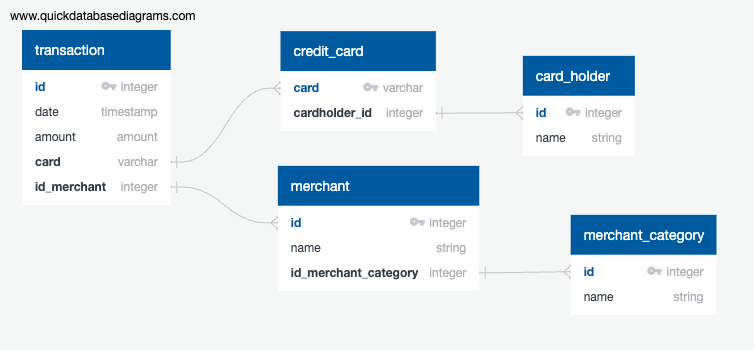

# Fraud Detection 
## Identifying potential fraudulent transactions 

In this review I wil be analyzing historical credit card transactions and consumption patterns in order to identify possible fraudulent transactions.

*Note data was provided by data-provider. 

### Data Model

Using the data provided by the data-provider, reviewed the csv files and diagramed the tables along with their respective relationships. 

### Data Analysis

All data analysis was conducted in the Challenge.ipynb post creating a pgAdmin PostgreSQL database named "fraud_detection". The Data Model above was used to map out database schema for imported csv data provided by the data-provider.

Findings based on questions:
 
- Part 1
  
  **Analysis:** Analyze small transactions; specifically less than $2.00
  
  **Findings:** Based on the data, $2 transactions make up about 5% of all transactions. Cardholders 12, 24 and 20 hold majority of the smaller transactions. If fraud is detected to be happening in lower denominations, then I would monitor these cardholder accounts, but there is no clear indication of fraud on any of these accounts.
  
- Part 2

  **Analysis:** Analyze highest transactions; specifically between 7:00 am and 9:00 am

  **Findings:** Based on the data, when comparing the top 100 transactions made between between 7:00 am and 9:00 am verses outside this timeframe, there is still no definitive data shoulds a series of fraudulent transactions. All of the transactions show different amounts and most of them are by different cardholders. In both views more than 80% of the transactions were less than $500. This would suggest looking at transactions using additional information from the CFO.  

### Resources
- PostgreSQL 15 database
- Jupyter Lab
- UC Berkeley Fintech BootCamp resources and materials

### 
